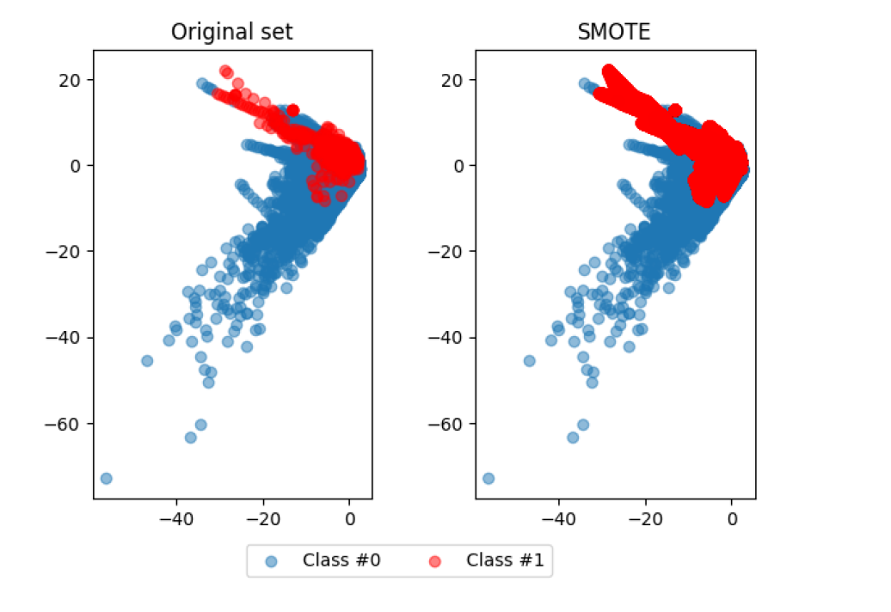
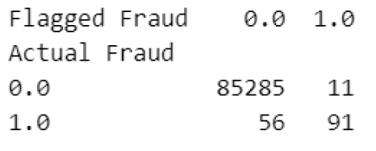
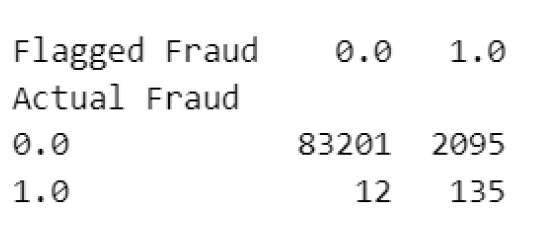

# Fraud Detection System

A fraud detection system is a technology-driven solution designed to identify and 
prevent fraudulent activities or transactions. It employs various techniques, such 
as data analysis, machine learning, and pattern recognition, to detect suspicious 
behavior and potential fraud in real-time or post-transaction analysis. 

## Requirements
- Python 3.6 or later 
- Flask 
- Prefect 
- Pandas 
- Scikit-Learn

## Dataset Exploration and Preprocessing
The dataset contains the following variables:
- Numerically encoded variables V1 to V28 which are the principal components obtained from a PCA transformation. Due to confidentiality issues, no background information about the original features was provided.
- The Amount variable represents the transaction amount.
- The Class variable shows whether the transaction was a fraud (1) or not (0).

By their nature, fraud occurrences are fortunately an extreme minority in any list of transactions. However, machine learning algorithms usually work best when the different classes contained in the dataset are equally present. Otherwise, there's little data to learn from. This problem is called the class imbalance.

To fix imbalance, we can re-balance our data using the synthetic minority oversampling technique (SMOTE). Unlike random oversampling, SMOTE is slightly more sophisticated since it does not just create exact copies of observations. Instead, it uses characteristics of nearest neighbours of fraud cases to create new, synthetic samples that are quite like the existing observations in the minority class.

## Model Training and Evaluation
n this fraud detection project, a machine learning model was created using logistic regression and SMOTE (Synthetic Minority Over-sampling Technique). Logistic regression is a widely used algorithm for binary classification tasks, making it suitable for detecting fraudulent transactions. The model was trained on a dataset containing historical transaction data, with the target variable indicating whether a transaction was fraudulent or legitimate. To address the issue of imbalanced data, where fraudulent transactions are significantly fewer than legitimate ones, SMOTE was applied. SMOTE generates synthetic samples of the minority class (fraudulent transactions) to balance the dataset, thereby improving the model's ability to accurately detect fraudulent activities. The combination of logistic regression and SMOTE helps create a robust and effective fraud detection model for identifying potential fraudulent transactions.

After the logistic regression model was trained using SMOTE and evaluated, it was saved as a pickle file. Saving the model allows for easy reusability and portability. The pickle file contains the trained model's parameters and configuration, enabling it to be used later in the data processing pipeline for real-time fraud detection. By loading the model from the pickle file, the system can make predictions on new transactions efficiently and accurately. This approach ensures that the trained model remains consistent and can be seamlessly
integrated into the fraud detection pipeline whenever new data needs to be processed and evaluated for potentially fraudulent activities.

Without SMOTE

With SMOTE

## Pipeline with Prefect

Here is an explanation of the code:
### Importing libraries:
- Pandas is imported as pd for data manipulation.
- Time delta is imported from datetime to define time intervals for scheduling.
- Necessary modules from Prefect are imported for task and flow creation.
- pickle is imported to load the trained model from a pickle file.
- time is imported to introduce delays between pipeline runs.
### Task Definitions:
- The read_csv_file task reads data from a CSV file and returns a DataFrame.
- The load_model task loads the trained model from a pickle file.
10
- The preprocess_data task preprocesses the input data by selecting relevant columns.
- The predict_data task uses the loaded model to predict fraud on the processed data.
- The write_csv_file task writes the processed data and predictions to an output CSV file.
- The combine_data task combines the processed data, actual labels, and predictions into a single DataFrame.
### Flow Definition:
- The process_data flow is defined using the @flow decorator.
- File paths for input and output CSV files are defined.
- The read_csv_file task is called to read data from the input CSV files.
- The preprocess_data task is called to preprocess the data.
- The load_model task is called to load the trained model.
- The predict_data task is called to predict fraud using the loaded model.
- The combine_data task is called to combine the data, actual labels, and predictions.
- The write_csv_file task is called to write the combined data to the output CSV file.
### Running the Pipeline:
- The pipeline is executed using a loop that runs the process_data flow multiple times.
- A delay of 5 seconds is introduced between each pipeline run using time.sleep().
This pipeline continuously reads data from two CSV files, preprocesses the data, applies the loaded model to predict fraud, combines the predictions with other data, and writes the results to an output CSV file. The pipeline runs every 5 seconds in this example, but the timing can be adjusted based on the project requirements.

## Flask Web App

Here's an explanation of the code:
- Importing Libraries: The necessary libraries for Flask, CSV handling, and time are imported.
- Flask App Initialization: An instance of the Flask application is created with the Flask(__name__, static_url_path='/static') line.
- CSV File Path: The path to the output CSV file generated by the fraud detection pipeline is defined.
- classify_last_n_lines Function: This function takes a file path and the number of lines to classify as inputs. It reads the last n lines from the file, classifies each line based on the values in the last two columns, and returns a list of classifications.
- get_data Route: This route is triggered when the /get_data endpoint is accessed. It calls the classify_last_n_lines function with the CSV file path and the desired number of lines to classify. The result is returned as the response.
- search_csv_file Function: This function takes a filename and a search value as inputs. It reads the CSV file line by line and searches for a row where the first column matches the search value. If a match is found, the row is returned; otherwise, None is returned.
transaction_details Route: This route is triggered when the /transaction_details endpoint is accessed with a POST request. It retrieves the transaction ID from the form data, calls the search_csv_file function to find the details of the transaction in the CSV file, and renders the transaction.html template with the transaction details.
- display_csv Route: This route is the home page route ("/"). It calls the classify_last_n_lines function to get the latest classifications from the CSV file and renders the home.html template with the result.
- Flask App Execution: The Flask application is run with the app.run(debug=True) line, allowing the web app to be accessed and debug information to be displayed.

In summary, this Flask web application provides functionality to display the latest fraud classification results, search for transaction details, and visualize the data processed by the fraud detection pipeline.